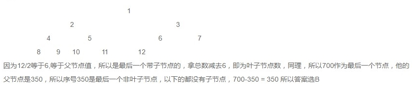

# 二叉树

L、D、R分别表示遍历左子树、访问根结点和遍历右子树

  - 先序遍历：DLR
  - 中序遍历：LDR
  - 后序遍历：LRD

> 仅有前序和后序遍历，不能确定一个二叉树，必须有中序遍历的结果

## 二叉树的性质

  - `性质1`：在二叉树中第 i 层的结点数最多为 $2^{i-1}$（i ≥ 1）
  - `性质2`：高度为k的二叉树其结点总数最多为 $2^{k}－1$（k ≥ 1）
  - `性质3`：对任意的非空二叉树 T ，如果叶结点的个数为 $n_0$，而其度为 2 的结点数为 $n_2$，则：$n_0 = n_2 + 1$ 


## 满二叉树

深度为k，且有 $2^k-1$ 个节点称之为 **满二叉树**；

  - `性质4`：第i层上的节点数为 $2^{i-1}$；

## 完全二叉树

深度为k，有n个节点的二叉树，当且仅当其每一个节点都与深度为k的满二叉树中，序号为1至n的节点对应时，称之为`完全二叉树`。

- `性质5`：对于具有n个结点的完全二叉树的高度为 $\log_{2}^{n}+1$

求完全二叉树的叶子结点个数：



## 二叉树的构造

```C
//n 表示当前结点字符
Node* tree(vector<char> data, int n) {

    Node* node;

    if (n >= data.size())
        return NULL;
    if (data[n] == '#')
        return NULL;

    node = new Node;
    node->data = data[n];

    node->left = tree(data, n + 1);
    node->right = tree(data, n + 2);
    return node;
}
```

## 二叉查找树

二叉查找树，也称二叉搜索树、有序二叉树，排序二叉树，是指一棵空树或者具有下列性质的二叉树：

  - 任意节点的左子树不空，则左子树上所有结点的值均小于它的根结点的值；
  - 任意节点的右子树不空，则右子树上所有结点的值均大于它的根结点的值；
  - 任意节点的左、右子树也分别为二叉查找树；
  - 没有键值相等的节点。

二分查找的时间复杂度是O(log(n))，最坏情况下的时间复杂度是O(n)（相当于顺序查找）

## 平衡二叉树

平衡树是计算机科学中的一类改进的二叉查找树。一般的二叉查找树的查询复杂度是跟目标结点到树根的距离（即深度）有关，因此当结点的深度普遍较大时，查询的均摊复杂度会上升，为了更高效的查询，平衡树应运而生了。**平衡指所有叶子的深度趋于平衡，更广义的是指在树上所有可能查找的均摊复杂度偏低。**

### [AVL树](https://zh.wikipedia.org/wiki/AVL%E6%A0%91)

AVL树是最先发明的 **自平衡二叉查找树**。在AVL树中任何节点的两个子树的高度最大差别为一，所以它也被称为高度平衡树。

  - 它的左子树和右子树都是平衡二叉树。
  - 左子树和右子树的深度之差的绝对值不超过1。

增加和删除可能需要通过一次或多次树旋转来重新平衡这个树。

  - 右旋：左结点转到根节点位置。
  - 左旋：右节点转到根节点位置。

> 高度为`k`的AVL树，节点数N最多$2^k -1$，即满二叉树；
