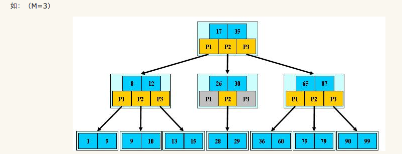

# B树

B树是一种自平衡的树，能够保持数据有序。这种数据结构能够让查找数据、顺序访问、插入数据及删除的动作，复杂度均为 $O(n)$。总的来说，B树是一个泛化的二叉查找树，一个节点可以拥有两个以上的子节点。但其与自平衡二叉查找树不同，B树更适合大数据块的存储系统，例如：磁盘。

在B树中，内部（非叶子）节点可以拥有可变数量的子节点（数量范围预先定义好）。当数据被插入或从一个节点中移除，它的子节点数量发生变化。为了维持在预先设定的数量范围内，内部节点可能会被 **合并** 或者 **分离**。因为子节点数量有一定的允许范围，所以B树不需要像其他自平衡查找树那样频繁地重新保持平衡，但是由于节点 **没有被完全填充**，可能浪费了一些空间。子节点数量的上界和下界依特定的实现而设置。例如，在一个2-3 B树（通常简称2-3树），每一个内部节点只能有 2 或 3 个子节点。

根据 Knuth 的定义，一个 m 阶的B树是一个有以下属性的树：

- 每一个节点最多有 m 个子节点
- 每一个非叶子节点（除根节点）最少有 $m\div 2$ 个子节点
- 如果根节点不是叶子节点，那么它至少有两个子节点
- 有 k 个子节点的非叶子节点拥有 k − 1 个键
- 所有的叶子节点都在同一层

每一个内部节点的键将节点的子树分开。例如，如果一个内部节点有 3 个子节点（子树），那么它就必须有两个键： a1 和 a2 。左边子树的所有值都必须小于 a1 ，中间子树的所有值都必须在 a1 和a2 之间，右边子树的所有值都必须大于 a2 。

B树内的节点可分为三类：

- 内部节点：内部节点是除叶子节点和根节点之外的所有节点。它们通常被表示为一组有序的元素和指向子节点的指针。
- 根节点：根节点拥有的子节点数量的上限和内部节点相同，但是没有下限。
- 叶子节点：叶子节点对元素的数量有相同的限制，但是没有子节点，也没有指向子节点的指针。

## B树的查找

在B树中的查找给定关键字的方法 **类似于二叉排序树上的查找，不同的是在每个节点上确定向下查找的路径不一定是二路的，而是n+1路的**。因为节点内的关键字序列key[1..n]有序，故既可以使用顺序查找，也可以使用二分查找。在一棵B树上查找关键字为k的方法为：将k与根节点中的key[i]进行比较：
  1. 若k=key[i]，则查找成功；
  2. 若k<key[1]，则沿指针ptr[0]所指的子树继续查找；
  3. 若key[i]<k<key[i+1]，则沿着指针ptr[i]所指的子树继续查找；
  4. 若k>key[n]，则沿着指针ptr[n]所指的子树继续查找。

## B树的插入

将关键字k插入到B树的过程分两步完成：

  1. 利用B树的查找算法查找出该关键字的插入节点(注意B树的插入节点一定属于最低非叶子节点层)。

  2. 判断该节点是否还有空位，即判断该节点是否满足n < m-1，若满足：直接把关键字k插入到该节点合适位置上；若不满足：分裂节点，取一新节点，把原节点上的关键字和k按升序排列后，从中间位置(m/2)处把关键字(不包括中间位置的关键字)分成两部分，左部分所含关键字放在旧节点中，右部分关键字放在新节点中，中间位置的关键字连同新节点的存储位置插入到双亲节点。如果双亲节点的关键字个数也超出max则再分裂。

## B树的删除

首先查找B树中需删除的元素，如果该元素在B树中存在，则将该元素在其结点中进行删除；如果删除该元素后，首先判断该元素是否有左右孩子结点，如果有，则上移孩子结点中的某相近元素到父节点中，然后是移动之后的情况；如果没有，直接删除后，然后是移动之后的情况。

删除元素，移动相应元素之后，如果某结点中元素数目（即关键字数）小于Min(m/2)-1，则需要看其某相邻兄弟结点是否丰满，如果丰满，则向父节点借一个元素来满足条件；如果其相邻兄弟都刚脱贫，即借了之后其结点数目小于Min(m/2)-1，则该结点与其相邻的某一兄弟结点进行“合并”成一个结点，

## B+树

B+ 树是 B 树的变体，也是一种多路搜索树。m阶的 B+ 树和 B 树的主要差异如下：

  - 在B+树中，**具有n个关键字的节点含有n个子树**，即每个关键字对应一个子树，而在B树中，具有n个关键字的节点含有(n+1)个子树。
  - 在B+树中，每个节点(除根节点外)中的关键字个数n的取值范围是[m/2] <= n <= m，根节点n的取值范围2 <=n <=m；而在B树中，除根节点外，其他所有非叶子节点的关键字个数：[m/2]-1 <= n <= m-1，根节点关键字个数为1 <= n <= m-1
  - **B+树中所有叶子节点包含了全部关键字**，即其他非叶子节点中的关键字包含在叶子节点中，而在B树中，关键字是不重复的。
  - **B+树中所有非叶子节点仅起到索引的作用**，即节点中每个索引项值含有对应子树的最大关键字和指向该子树的指针，不含有该关键字对应记录的存储地址。而在B树中，每个关键字对应一个记录的存储地址。
  - **在 B+ 树所有叶子节点链接成一个不定长的线性表**。

### B+树的查找

在B+树中可以采用两种查找方式：

  - 直接从最小关键字开始顺序查找。
  - 从B+树的根节点开始随机查找。这种查找方式与B树的查找方式类似，只是在分支节点上的关键字与查找值相等时，查找并不会结束，要继续查到叶子节点为止，此时若查找成功，则按所给指针取出对应元素。

在B+树中，不管查找是否成功，**每次查找都是经历一条树从根节点到叶子节点的路径**。

### B+树的插入

  1. 首先，查找要插入其中的节点的位置。接着把值插入这个节点中。
  2. 如果没有节点处于违规状态则处理结束。
  3. 如果某个节点有过多元素，则把它分裂为两个节点，每个都有最小数目的元素。在树上递归向上继续这个处理直到到达根节点，如果根节点被分裂，则创建一个新根节点。为了使它工作，元素的最小和最大数目典型的必须选择为使最小数不小于最大数的一半。

### B+树的删除

  1. 首先，查找要删除的值。接着从包含它的节点中删除这个值。
  2. 如果没有节点处于违规状态则处理结束。
  3. 如果节点处于违规状态则有两种可能情况：
       - 它的兄弟节点，可以把一个或多个它的子节点转移到当前节点，而把它返回为合法状态。如果是这样，在更改父节点和两个兄弟节点的分离值之后处理结束。
       - 它的兄弟节点由于处在低边界上而没有额外的子节点。在这种情况下把两个兄弟节点合并到一个单一的节点中，而且我们递归到父节点上，因为它被删除了一个子节点。持续这个处理直到当前节点是合法状态或者到达根节点，在其上根节点的子节点被合并而且合并后的节点成为新的根节点。

### B+树的优势所在

为什么说B+树比B树更适合实际应用中操作系统的文件索引和数据库索引？

  1. B+树的中间节点能存储更多指针
  2. **B+树的查询效率更加稳定**：关键字查询的路径长度相同
  3. **减少回溯**：由于B+树中叶子节点存在指针，所以在范围查找时不需要回溯到父节点，直接类型链表遍历即可，减少IO
